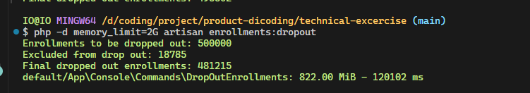

# Technical Exercise: Product Engineer

### Setup

-   This app is using laravel 10
-   Database MySQL required
-   Migrate database using command `php artisan migrate`
-   Then seed database by seed with `php artisan db:seed`, because seed data over 10k row, im seed one by one alternately by comment the seeder file inside `DatabaseSeeder.php`
-   Then run `php artisan enrollments:dropout`, im adding memory limit php running by using this command `php -d memory_limit=2G artisan enrollments:dropout`

### Benchmark Test

By this Technical Exercise: Product Engineer, I have been assigned to improved and enhanced the query of dropout enrollments that has passed the deadline. In previous code, there are looping process to find is enrollment has exam with status `IN_PROGRESS` or submission with status `WAITING_REVIEW`. If any, exclude from drop out lists. this loop has add resource usages, then i improved by process all data using batch process with chunkSize 5k. I'm also pick select data that only needed like id, student_id, and course_id. This selects will increase the speed of query, inside batch process, i collect the id of student and course for find the exam and submission data. This batch process is used also for saving data with no big size, per-chunk. im getting `120102 ms` when running this command with `822 Mib` memory usages.

#### Here's the result of benchmark process

